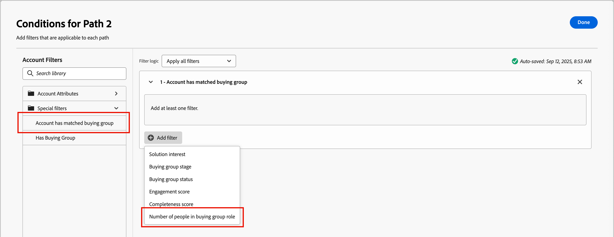

# Dividere e unire i percorsi

Utilizza i nodi di percorsi di unione e suddivisione per segmentare persone o account in base alle condizioni definite. Crea percorsi per il pubblico o l’elenco di account in base alle condizioni, definisci ogni percorso con nodi di azione ed evento per il segmento, quindi combina i percorsi e continua il percorso.

{width="30"} [Guarda il video introduttivo](#overview-video)

Un nodo _Percorsi suddivisi_ definisce uno o più percorsi segmentati in base ai filtri per account **_o_** o persone. Una suddivisione basata su un filtro persone viene automaticamente chiusa con un nodo percorsi unione in modo che tutte le persone possano passare al passaggio successivo senza perdere il contesto dell’account.

>[!NOTE]
>
>Sono supportati un massimo di 25 percorsi.

## Dividere i percorsi per account

(Solo percorsi di account)

I percorsi suddivisi per account possono includere azioni ed eventi sia per gli account che per le persone. Questi percorsi possono essere ulteriormente suddivisi.

_&#x200B;**Funzionamento di un percorso suddiviso per nodo account**&#x200B;_

* Ogni percorso aggiunto include un nodo finale con la possibilità di aggiungere nodi a ogni nodo edge.
* È possibile nidificare il percorso suddiviso per nodi di account (è possibile dividerlo più volte per account).
* La valutazione di ciascun percorso è dall&#39;alto verso il basso. Se un account corrisponde al primo e al secondo percorso, procede solo lungo il primo percorso.
* È possibile combinare due o più percorsi utilizzando un nodo di unione.
* Il nodo supporta la definizione di un percorso _[!UICONTROL Altri account]_, in cui è possibile aggiungere azioni o eventi per account che non corrispondono a uno dei segmenti o percorsi definiti.

{width="700" zoomable="yes"}

### Condizioni del percorso dell’account

| Condizioni del percorso | Descrizione |
| --------------- | ----------- |
| Attributi dell’account | Attributi dal profilo dell’account, tra cui: <li>Entrate annuali <li>Città <li>Paese <li>Dimensione dipendente <li>Settore <li>Nome <li>Codice SIC <li>Stato <li>Ha `<relational schema>` (Vedi [Filtro dati personalizzato](#custom-data-filtering)) |
| [!UICONTROL Filtri speciali] > [!UICONTROL L&#39;account corrisponde al gruppo di acquisto] | L’account corrisponde a uno o più gruppi di acquisto. Può essere valutato in base a uno o più dei seguenti vincoli per un gruppo di acquisto abbinato: <li>Interesse soluzione <li>Fase gruppo acquisti <li>Stato gruppo acquisti <li>Punteggio di coinvolgimento <li>Punteggio di completezza <li> Numero di persone nel ruolo del gruppo acquisti |
| [!UICONTROL Filtri speciali] > [!UICONTROL Ha un gruppo di acquisto] | L’account non ha membri di gruppi di acquisto. Può anche essere valutato in base a uno o più dei seguenti criteri: <li>Interesse soluzione <li>Fase gruppo acquisti <li>Stato gruppo acquisti <li>Punteggio di coinvolgimento <li>Punteggio di completezza |

>[!NOTE]
>
>Il filtro _[!UICONTROL Ha il gruppo acquisti]_ è contrassegnato per essere dichiarato obsoleto in futuro. Per i nuovi percorsi, utilizzare il filtro _[!UICONTROL Account con gruppo di acquisto]_ corrispondente, che include tutti gli stessi vincoli.

### Aggiungere un percorso di suddivisione per nodo account

1. Passa alla mappa del percorso.

1. Fare clic sull&#39;icona più ( **+** ) in un percorso e scegliere **[!UICONTROL Dividi percorsi]**.

   {width="300" zoomable="no"}

1. Nelle proprietà del nodo a destra, scegli **[!UICONTROL Account]** per la suddivisione.

1. Per definire una condizione applicabile a _[!UICONTROL Percorso 1]_, fare clic su **[!UICONTROL Applica condizione]**.

   {width="500" zoomable="yes"}

1. Nell’editor delle condizioni, aggiungi uno o più filtri per definire il percorso di divisione.

   * Trascina e rilascia gli attributi del filtro dal menu di navigazione a sinistra e completa la definizione della corrispondenza.

   * Ottimizza le condizioni applicando la **[!UICONTROL logica filtro]** nella parte superiore. Scegli di far corrispondere tutti i filtri o qualsiasi filtro.

     {width="700" zoomable="yes"}

   * Fai clic su **[!UICONTROL Fine]**.

1. Per aggiungere altri percorsi, fare clic su **[!UICONTROL Aggiungi percorso]** e ripetere i passaggi precedenti per aggiungere le condizioni applicabili al percorso.

   È inoltre possibile etichettare ogni percorso in base a queste condizioni o utilizzare le etichette predefinite.

1. Se necessario, riordinare i percorsi in base alla priorità desiderata per la suddivisione.

   Il filtro dei percorsi viene valutato in ordine decrescente. Ogni account procede lungo il primo percorso corrispondente.

   Fai clic sulle frecce su e giù in alto a destra di ciascuna scheda di percorsi per spostarla in alto o in basso nell’elenco dei percorsi.

   {width="500" zoomable="yes"}

1. Abilita l&#39;opzione **[!UICONTROL Altri account]** per definire il percorso predefinito per gli account che non corrispondono ai segmenti/percorsi definiti.

   Se questa opzione non è abilitata, il percorso termina per i conti che non corrispondono a un segmento/percorso definito all’interno della suddivisione.

### Filtro gruppo acquisti per account {#buying-group-filtering-accounts}

Puoi definire un percorso per gli account associati ai gruppi di acquisto e filtrarlo utilizzando i criteri del gruppo di acquisto. Utilizza il filtro **[!UICONTROL Account con gruppo di acquisto corrispondente]** per definire il segmento del percorso utilizzando un gruppo di acquisto corrispondente. Questo filtro include anche l’opzione di identificazione degli account in base al numero di ruoli assegnati all’interno di un gruppo di acquisto corrispondente.

Ad esempio, potrebbe essere utile valutare lo stato di preparazione di un gruppo di acquisto in base al livello di approfondimento (numero di persone) di cui dispone in ruoli diversi, ad esempio tre decision maker e due influencer. In questo caso, imposta la condizione per eseguire il targeting dei conti con un minimo di tre (3) decision maker e due (2) influencer in un gruppo di acquisto abbinato:

1. Fai clic su **[!UICONTROL Aggiungi filtro]** e scegli il filtro **[!UICONTROL Numero di persone nell&#39;acquisto del ruolo del gruppo]**.

   {width="700" zoomable="yes"}

1. Definisci il primo parametro di ruolo.

   * Impostare la valutazione del numero di persone su `at least` con un valore di `3`.
   * Impostare la valutazione del ruolo su `is` e scegliere `Decision Maker` dall&#39;elenco dei ruoli.

1. Ripeti il passaggio 1 per aggiungere un altro parametro di ruolo del gruppo di acquisto.

1. Definite il secondo parametro di ruolo.

   * Impostare la valutazione del numero di persone su `at least` con un valore di `2`.
   * Impostare la valutazione del ruolo su `is` e scegliere `Influencer` dall&#39;elenco dei ruoli.

   {width="700" zoomable="yes"}

1. Fai clic su **[!UICONTROL Fine]** quando sono state definite tutte le condizioni per il percorso.

Per gli account identificati, potresti quindi aggiungere un nodo di azione nel percorso per aggiornare lo stato del gruppo di acquisto o della fase o per inviare un messaggio e-mail di avviso sulle vendite.

### Filtro dati personalizzato

[!BADGE Beta]{type=Informative url="/help/user/admin/engagement-score-weighting.md" tooltip="Disponibile come funzione beta sull’architettura semplificata"}

Puoi utilizzare gli schemi relazionali (classi basate su modelli) per suddividere i percorsi in base all’account. Gli oggetti personalizzati sono definiti all&#39;interno di _schemi relazionali_ e un amministratore di prodotto può [configurare i campi dello schema relazionale](../admin/xdm-field-management.md#relational-schemas) in [!DNL Journey Optimizer B2B Edition]. I campi dello schema selezionati sono disponibili nell’editor delle condizioni e possono essere utilizzati nel percorso suddiviso dai nodi dell’account.

{width="700" zoomable="yes"}

<!-- SPHR-23746

Note: These are currently going under Account Attributes folder, which is a bug (SPHR-21734). This will move to Special filters when resolved (January release).

This will also be available for split paths by people (under special filters) for the M 1.5 GA release.
-->

## Dividi percorsi per persone

I percorsi Dividi per persone possono includere solo azioni persone. Questi percorsi non possono essere nuovamente suddivisi e uniti automaticamente.

_&#x200B;**Funzionamento di un percorso suddiviso per nodo persone**&#x200B;_

* I nodi suddivisi per persone funzionano all&#39;interno di una combinazione di _nodo raggruppato_ split-merge. I percorsi suddivisi si uniscono automaticamente in modo che tutte le persone possano passare al passaggio successivo senza perdere il contesto dell’account.
* I nodi Dividi per persone non possono essere nidificati (non è possibile aggiungere un percorso diviso per le persone in un percorso che si trova in questo nodo raggruppato).
* La valutazione di ciascun percorso è dall&#39;alto verso il basso. Se una persona corrisponde per il primo e il secondo percorso, procede solo lungo il primo percorso.
* Il nodo supporta l&#39;utilizzo di _relazioni account-persona_, che consente di filtrare le persone in base al loro ruolo (ad esempio, collaboratore esterno o dipendente a tempo pieno) come definito nella relazione.
* Il nodo supporta la definizione di un percorso _[!UICONTROL Altre persone]_, in cui è possibile aggiungere azioni o eventi per le persone che non corrispondono a uno dei segmenti o percorsi definiti.

{width="700" zoomable="yes"}

### Filtri percorso persone

| Filtri | Descrizione |
| ------------ | ----------- |
| [!UICONTROL Cronologia attività] > [!UICONTROL E-mail] | Attività e-mail basate su condizioni valutate utilizzando uno o più messaggi e-mail selezionati di versioni precedenti nel percorso: <li>[!UICONTROL Collegamento selezionato nell&#39;e-mail] <li>E-mail aperta <li>E-mail consegnata <li>È stata inviata l&#39;e-mail  **[!UICONTROL Passa al filtro di inattività&#x200B;]**. Utilizzare questa opzione per filtrare in base alla mancanza di attività (una persona non aveva l&#39;attività e-mail). |
| [!UICONTROL Cronologia attività] > [!UICONTROL Messaggio SMS] | Attività SMS basate su condizioni valutate utilizzando uno o più messaggi SMS selezionati da in precedenza nel percorso: <li>[!UICONTROL Collegamento selezionato in SMS] <li>[!UICONTROL SMS non recapitato]  **[!UICONTROL Passa al filtro di inattività&#x200B;]**. Utilizzare questa opzione per filtrare in base all&#39;assenza di attività (una persona non aveva l&#39;attività SMS). |
| [!UICONTROL Cronologia attività] > [!UICONTROL Valore dati modificato] | Per un attributo persona selezionato, si è verificata una modifica del valore. Questi tipi di modifica includono: <li>Nuovo valore<li>Valore precedente<li>Motivo<li>Origine<li>Data di attività<li>Min numero di volte  **[!UICONTROL Passa al filtro di inattività&#x200B;]**. Utilizzare questa opzione per filtrare in base alla mancanza di attività (una persona non ha modificato il valore dei dati). |
| [!UICONTROL Cronologia attività] > [!UICONTROL Momento di interesse] | Attività momento di interesse definita nell&#39;istanza [!DNL Marketo Engage] associata. I vincoli includono: <li>Milestone<li>E-mail<li> **[!UICONTROL Passa al filtro di inattività&#x200B;]**. Utilizzare questa opzione per filtrare in base alla mancanza di attività (una persona non ha avuto un momento di interesse). |
| [!UICONTROL Cronologia attività] > [!UICONTROL Pagina Web visitata] | Attività pagina Web per una o più pagine Web gestite dall&#39;istanza [!DNL Marketo Engage] associata. I vincoli includono: <li>Pagina Web (obbligatoria)<li>Data di attività<li>Indirizzo IP client <li>Querystring <li>Referrer <li>Agente utente <li>Motore di ricerca <li>Query di ricerca <li>URL personalizzato <li>Token <li>Browser <li>Piattaforma <li>Dispositivo <li>Min numero di volte  **[!UICONTROL Passa al filtro di inattività&#x200B;]**. Utilizzare questa opzione per filtrare in base alla mancanza di attività (una persona non ha visitato la pagina Web). |
| [!UICONTROL Attributi della persona] | Attributi dal profilo della persona, tra cui: <li>Città <li>Paese <li>Data di nascita <li>Indirizzo e-mail <li>E-mail non valida <li>E-mail sospesa <li>Nome <li>Area dello stato dedotta<li>Posizione lavorativa <li>Cognome <li>Numero di telefono cellulare <li>Punteggio di coinvolgimento della persona <li>Numero di telefono <li>Codice postale <li>Stato <li>Annulla l&#39;iscrizione <li>Motivo per annullamento abbonamento |
| [!UICONTROL Filtri speciali] > [!UICONTROL Membro del gruppo di acquisto] | La persona è o non è un membro del gruppo di acquisto valutato in base a uno o più dei seguenti criteri: <li>Interesse soluzione</li><li>Stato gruppo acquisti</li><li>Punteggio di completezza</li><li>Punteggio di coinvolgimento</li><li>È stato rimosso</li><li>Ruolo</li> |
| [!UICONTROL Filtri speciali] > [!UICONTROL Membro dell&#39;elenco] | La persona è o non è membro di uno o più elenchi [!DNL Marketo Engage]. |
| [!UICONTROL Filtri speciali] > [!UICONTROL Membro del programma] | La persona è o non è membro di uno o più programmi [!DNL Marketo Engage]. |

### Condizioni del percorso account-persona

| Condizioni del percorso | Descrizione |
| --------------- | ----------- |
| [!UICONTROL Ruolo nell&#39;account] | Alla persona è o non è assegnata una mansione nell’account. Vincoli facoltativi: <li>Nome ruolo |

### Aggiungere un percorso suddiviso per nodo persone

>[!NOTE]
>
>Quando si dividono i percorsi in base alle persone, viene inserito automaticamente un nodo _Chiudi percorsi divisi_ per terminare la divisione. Un percorso suddiviso per persone consente solo _di eseguire un&#39;azione_ sui nodi persone.

1. Passa alla mappa del percorso.

1. Fare clic sull&#39;icona più ( **+** ) in un percorso e scegliere **[!UICONTROL Dividi percorsi]**.

   {width="300" zoomable="no"}

1. Nelle proprietà del nodo a destra, scegli **[!UICONTROL Persone]** per la suddivisione.

1. (Solo percorsi di account) Imposta gli **[!UICONTROL attributi utilizzati per le condizioni]**.

   * Scegli **[!UICONTROL Solo attributi persone]** per utilizzare le condizioni relative al profilo persona.
   * Scegliere **[!UICONTROL Solo attributi persona-account]** per utilizzare le condizioni relative all&#39;appartenenza al ruolo della persona all&#39;interno di un account.

1. Per definire una condizione applicabile a _[!UICONTROL Percorso 1]_, fare clic su **[!UICONTROL Applica condizione]**.

1. Nell’editor delle condizioni, aggiungi uno o più filtri per definire il percorso di divisione.

   * Trascina e rilascia uno dei filtri persone dalla navigazione a sinistra e completa la definizione della corrispondenza.

     >[!NOTE]
     >
     >Se hai dei campi persona personalizzati definiti nello schema del pubblico dell’account in Experience Platform, questi campi sono disponibili per l’utilizzo come attributi persona in determinate condizioni.

   * Ottimizza le condizioni applicando la **[!UICONTROL logica filtro]** nella parte superiore. Scegli di soddisfare tutte le condizioni dell’attributo o qualsiasi condizione.

     {width="700" zoomable="yes"}

   * Fai clic su **[!UICONTROL Fine]**.

1. Per aggiungere altri percorsi, fare clic su **[!UICONTROL Aggiungi percorso]** e ripetere i passaggi precedenti per aggiungere le condizioni applicabili al percorso.

   È inoltre possibile etichettare ogni percorso in base a queste condizioni o utilizzare le etichette predefinite.

1. Se necessario, riordinare i percorsi in base alla priorità desiderata per la suddivisione.

   Il filtro dei percorsi viene valutato in ordine decrescente. Ogni persona procede lungo il primo percorso che corrisponde a.

   Fai clic sulle frecce su e giù in alto a destra di ciascuna scheda di percorsi per spostarla in alto o in basso nell’elenco dei percorsi.

   {width="500" zoomable="yes"}

1. Abilita l&#39;opzione **[!UICONTROL Altre persone]** per aggiungere un percorso predefinito per le persone che non corrispondono ai percorsi definiti.

   Se questa opzione non è abilitata, le persone che non corrispondono a un segmento/percorso definito si spostano oltre la divisione e procedono al passaggio successivo nel percorso.

   Quando hai definito le condizioni per ogni percorso per suddividere il pubblico a livello di persone, puoi aggiungere azioni che desideri eseguire sulle persone.

### Filtro attività

Per un percorso suddiviso per persone, puoi definire un percorso in base all’attività della persona relativa a:

* Messaggi e-mail da prima nel percorso
* Messaggi SMS da all’inizio del percorso
* Modifica del valore dei dati nel profilo della persona
* Momento di interesse (rilevato in [!DNL Marketo Engage]) associato a un&#39;e-mail, una pagina Web o una milestone
* Visita a una pagina Web (rilevata in [!DNL Marketo Engage])

>[!BEGINSHADEBOX &quot;Filtro inattività&quot;]

Per ciascuno dei filtri _[!UICONTROL Cronologia attività]_, è possibile abilitare l&#39;opzione **[!UICONTROL Passa a filtro inattività]**. Questa opzione trasforma il filtro in una valutazione per l’assenza di quel tipo di attività. Aggiungi ad esempio il filtro _[!UICONTROL E-mail]_ > _[!UICONTROL E-mail aperte]_ per creare un percorso per le persone che _&#x200B;**non hanno**&#x200B;_ aperto un&#39;e-mail in precedenza nel percorso. Abilita l’opzione di inattività e specifica l’e-mail. È consigliabile utilizzare il vincolo _[!UICONTROL Data attività]_ per definire un periodo di tempo per l&#39;inattività.

{width="700" zoomable="yes"}

>[!ENDSHADEBOX]

### Filtro appartenenza

Nella sezione _[!UICONTROL Filtri speciali]_ sono disponibili più filtri che è possibile utilizzare per valutare l&#39;appartenenza di una persona a un gruppo di acquisto o a un elenco di [!DNL Marketo Engage].

Ad esempio, se desideri creare un percorso per le persone che sono membri di un gruppo di acquisto e a cui è assegnato un ruolo particolare, aggiungi il filtro _[!UICONTROL Filtri speciali]_ > _[!UICONTROL Membro del gruppo di acquisto]_. Per il filtro, impostare l&#39;appartenenza come _true_, selezionare un _[!UICONTROL Interesse per la soluzione]_ associato a uno o più gruppi di acquisto e impostare il _[!UICONTROL Ruolo]_ che si desidera associare.

{width="700" zoomable="yes"}

È inoltre possibile includere ulteriori vincoli di appartenenza ai gruppi di acquisto:

* _[!UICONTROL Fase gruppo acquisti]_
* _[!UICONTROL Stato gruppo acquisti]_
* _[!UICONTROL Punteggio di completezza]_
* _[!UICONTROL Punteggio di coinvolgimento]_
* _[!UICONTROL Rimosso]_

>[!TIP]
>
>Per escludere i membri rimossi da un gruppo di acquisto, utilizzare il vincolo _[!UICONTROL Rimosso]_ impostato su `false`. È inoltre possibile includere in modo esplicito i membri rimossi impostando questo vincolo su `true`.

>[!BEGINSHADEBOX &quot;Elenco Marketo Engage e appartenenza al programma&quot;]

In [!DNL Marketo Engage], _Smart Campaigns_ controlla l&#39;appartenenza ai programmi per assicurarsi che i lead non ricevano e-mail duplicate e non siano membri di più flussi di e-mail contemporaneamente. In Journey Optimizer B2B, è possibile verificare l&#39;appartenenza all&#39;elenco [!DNL Marketo Engage] come condizione per il percorso di suddivisione da parte delle persone per eliminare la duplicazione nelle attività di percorso.

Per utilizzare l&#39;appartenenza all&#39;elenco in una condizione di suddivisione, espandere **[!UICONTROL Filtri speciali]** e trascinare la condizione **[!UICONTROL Membro dell&#39;elenco]** o **[!UICONTROL Membro del programma]** nello spazio del filtro. Completare la definizione del filtro per valutare l&#39;appartenenza a uno o più elenchi [!DNL Marketo Engage].

![Condizione Dividi percorso in base alle persone per l&#39;appartenenza all&#39;elenco [!DNL Marketo Engage]](./assets/node-split-paths-conditions-people-member-of-list.png){width="700" zoomable="yes"}
 

>[!NOTE]
>
>**Funzionalità obsolete**  
>
>Con l&#39;[architettura semplificata](../simplified-architecture.md) per Journey Optimizer B2B edition, il filtro in base all&#39;appartenenza a un elenco o a un programma in un&#39;istanza di Marketo Engage non è supportato.

>[!ENDSHADEBOX]

## Unisci percorsi

Aggiungi un nodo _Unisci percorsi_ per combinare diversi percorsi suddivisi per account nel percorso.

1. Passa alla mappa del percorso.

1. Fare clic sull&#39;icona più ( **+** ) in un percorso e scegliere **[!UICONTROL Dividi percorsi]**.

1. Fai clic sul nodo diviso per aprirne le proprietà a destra.

1. Fai clic su [!UICONTROL Aggiungi percorso] per creare tre percorsi.

1. Aggiungi una combinazione di azioni ed eventi a ciascun percorso.

1. Fai clic sull&#39;icona più ( **+** ) per uno di questi percorsi e scegli **[!UICONTROL Unisci]** dalle opzioni visualizzate.

   {width="400" zoomable="no"}

1. Nelle proprietà del nodo percorsi unione, seleziona i percorsi che desideri unire.

   {width="600" zoomable="yes"}

   A questo punto, i percorsi vengono uniti in modo che gli account dei percorsi selezionati si combinino in un unico percorso che può continuare a progredire attraverso il percorso.

1. Se necessario, puoi annullare l’unione dei percorsi tornando alle proprietà del nodo percorsi unione e deselezionando la casella di controllo per tutti i percorsi che desideri rimuovere.

## Video di panoramica

>[!VIDEO](https://video.tv.adobe.com/v/3443264/?captions=ita&learn=on)
