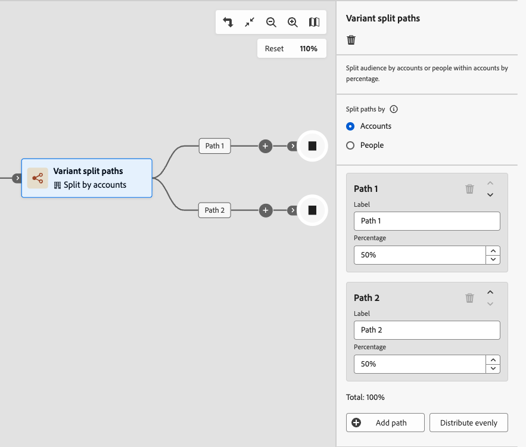

# Percorsi suddivisi per variante

Utilizza un nodo _Percorsi suddivisi variante_ per distribuire i conti in modo casuale tra due o più percorsi di percorso in base alle allocazioni percentuali definite. Questo nodo è utile per il test esplorativo di diverse tattiche di messaggistica, tempistica o coinvolgimento tra segmenti del pubblico del tuo account, senza applicare regole condizionali. Non è adatto per esperimenti A/B controllati che richiedono l’assegnazione di un percorso coerente per account.

>[!AVAILABILITY]
>
>Il nodo percorsi suddivisi varianti è attualmente disponibile per alcuni clienti come versione beta limitata, solo per **_percorsi di account_**. Il supporto per percorsi di persone è pianificato per una versione futura. Per ottenere l’accesso, contatta il tuo rappresentante Adobe.

## Confronto con percorsi suddivisi {#compare-split-paths}

Entrambi i _[percorsi suddivisi](./split-merge-paths-nodes.md)_ e _percorsi suddivisi varianti_ dividono gli account in più rami di percorso, ma utilizzano meccanismi diversi:

| Formato | Suddividi percorsi | Percorsi suddivisi per variante |
| -------- | ----------- | ------------------- |
| **Logica di assegnazione** | _Basato su regole condizionali_ - Ogni account viene valutato in base a condizioni definite e procede lungo il primo percorso corrispondente. | _Assegnazione casuale basata su percentuale_ - Gli account vengono distribuiti tra percorsi in base a percentuali configurate senza condizioni di filtro. |
| **Determinismo** | _Deterministico_ - Lo stesso account segue sempre lo stesso percorso purché soddisfi le stesse condizioni. | Non deterministico — lo stesso account può seguire percorsi diversi al rientro. |
| **Caso d’uso** | Segmento in base agli attributi noti dell’account o del gruppo di acquisto; valutazione ordinata per priorità. | Distribuisci in modo casuale gli account per testare messaggi, tempistiche o tattiche tra il pubblico del tuo account. |
| **Percorso altri account** | _Supportato_ - Gli account che non corrispondono a nessun percorso definito possono essere indirizzati a un percorso predefinito. | _Non applicabile_ — A ogni account viene assegnato uno dei percorsi definiti. |

## Dividi per account {#split-by-account}

Quando un account raggiunge un nodo di percorsi suddivisi variante, il nodo lo assegna esattamente a un percorso in base a percentuali configurate. L&#39;assegnazione utilizza un algoritmo basato sulle quote che tiene traccia del numero di account assegnati a ciascun percorso e si regola nel tempo per mantenere le proporzioni configurate.

* Ogni account viene assegnato esattamente a un percorso.
* L&#39;assegnazione è casuale e basata su quote. L’algoritmo regola dinamicamente le allocazioni per avvicinarsi alle percentuali configurate nell’intera popolazione.
* Il nodo supporta da 2 a 20 percorsi. Ogni percorso ha un nome configurabile e una percentuale intera da 1 a 99. La somma di tutte le percentuali di percorso deve essere esattamente pari al 100%.

>[!IMPORTANT]
>
>**Algoritmo basato su quote: non deterministico**
>
>L&#39;algoritmo di distribuzione utilizza l&#39;assegnazione casuale basata sulla quota. Questo algoritmo è **_non deterministico_**: lo stesso account potrebbe essere assegnato a un percorso diverso ogni volta che entra o entra di nuovo nel percorso. L&#39;assegnazione del percorso dipende dallo stato corrente della quota al momento della valutazione e non da una proprietà di conto fisso. Consulta [Limitazioni](#limitations) per i dettagli sui casi d&#39;uso che questo influisce.

### Algoritmo di distribuzione {#distribution-algorithm}

Il nodo percorsi suddivisi variante utilizza un algoritmo di assegnazione casuale _&#x200B;**basato su**&#x200B;_ quota. Quando un account raggiunge il nodo, il sistema valuta le assegnazioni di account esistenti per ciascun percorso e indirizza l&#39;account al percorso più al di sotto della quota configurata. Esistono due proprietà chiave per l’algoritmo:

* La distribuzione tiene traccia da vicino delle percentuali configurate in tutti i volumi di account. Poiché l&#39;algoritmo gestisce attivamente i conteggi delle quote, la distribuzione effettiva varia solo di un conto per percorso a causa dell&#39;arrotondamento quando i totali non si dividono in modo uniforme.
* L&#39;algoritmo utilizza un blocco pessimistico durante la valutazione delle quote per serializzare le assegnazioni, che garantisce un tracciamento accurato del conteggio nell&#39;esecuzione concorrente.

### Limitazioni {#limitations}

Esamina queste limitazioni prima di utilizzare percorsi di suddivisione varianti nei percorsi.

>[!CAUTION]
>
>**L&#39;assegnazione del percorso non è deterministica.**
>
>L&#39;algoritmo basato sulla quota non garantisce che lo stesso account segua sempre lo stesso percorso. Se un conto esce e entra nuovamente nel percorso, può essere assegnato a un percorso diverso a seconda dello stato della quota al momento della reintroduzione. Non utilizzare percorsi di suddivisione varianti per i casi d’uso che richiedono un’assegnazione coerente del percorso per account tra le istanze di percorso.

| Limitazione | Descrizione |
| ---------- | ----------- |
| **Non adatto per esperimenti controllati** | Poiché l&#39;assegnazione dei percorsi non è deterministica, i percorsi di suddivisione varianti sono **non idonei** per esperimenti A/B o scenari di attribuzione che richiedono che un determinato account riceva costantemente lo stesso trattamento. I casi d’uso che dipendono dalla coerenza per account, come la misurazione dei tassi di risposta o l’attribuzione dei risultati a un’esperienza specifica, possono produrre risultati inaffidabili. |
| **Deriva di arrotondamento minore** | Quando il conteggio totale dei conti non è divisibile in modo uniforme in base alle percentuali configurate, la distribuzione può essere disattivata di almeno un conto per percorso. Si tratta di un comportamento di arrotondamento previsto e non di un errore. |
| **L&#39;assegnazione del percorso non è idempotente** | Una nuova immissione nel percorso può produrre un&#39;assegnazione di percorso diversa per lo stesso account. Se la progettazione del percorso presuppone che un conto segua sempre lo stesso percorso dopo il nodo diviso, questo presupposto non vale. |
| **Solo percorsi di account** | I percorsi di suddivisione delle varianti sono supportati solo nei percorsi di account. I percorsi di persone non sono attualmente supportati. |
| **Nessun filtro condizionale** | A differenza di _Percorsi suddivisi_, i percorsi suddivisi varianti non applicano condizioni. Ogni account che raggiunge il nodo viene assegnato a un percorso. |

## Dividi per persone {#split-by-people}

In un percorso di account, puoi anche utilizzare un nodo di percorsi suddivisi di varianti per distribuire _persone all&#39;interno di account_ in modo casuale tra percorsi basati su percentuali. Questo tipo di suddivisione è utile quando si desidera testare contenuti o esperienze diversi a livello di persona mentre gli account continuano a spostarsi all’interno del percorso. Il nodo percorsi suddivisi per persone della variante funziona con i seguenti guardrail:

* Il nodo funziona come _nodo raggruppato_, ovvero una combinazione di unione divisa. I percorsi suddivisi si chiudono automaticamente in corrispondenza di un nodo di unione corrispondente in modo che tutte le persone possano procedere senza perdere il contesto dell’account.
* Ogni persona nell’account viene assegnata a un solo percorso in base alle percentuali configurate.
* Lo stesso algoritmo basato sulla quota utilizzato per gli account si applica alle persone. L’assegnazione del percorso non è deterministica e la stessa persona può seguire un percorso diverso al rientro.
* Solo i nodi _[!UICONTROL Esegui un&#39;azione]_ per le persone sono supportati nei percorsi. I percorsi non possono essere ulteriormente suddivisi.

>[!BEGINSHADEBOX &quot;Comportamento di distribuzione tra persone&quot;]

Le persone all’interno di un account vengono elaborate come batch. Il numero assegnato a ogni percorso è calcolato come `floor(percentage / 100 × people_in_account)` e il **ultimo percorso configurato riceve tutte le persone rimanenti**. Ciò significa che:

* Quando un account ha un numero dispari di persone, l’ultimo percorso riceve una persona in più rispetto ai percorsi precedenti.
* Per gli account con una singola persona, questa viene sempre assegnata al primo percorso indipendentemente dalle percentuali configurate.
* Per gli account con poche persone (meno di 10), la distribuzione per account può differire notevolmente dalle percentuali configurate. La distribuzione converge verso i rapporti configurati quando misurata tra più account.

>[!NOTE]
>
>Questo comportamento di arrotondamento si applica per batch di conti e non per tutti gli account del percorso. L’ultimo percorso riceve sistematicamente un numero leggermente maggiore di persone rispetto a quanto configurato quando le dimensioni dell’account sono dispari. Questo è il comportamento previsto.

>[!ENDSHADEBOX]

## Aggiungi un nodo di percorsi suddivisi variante {#add-variant-split-paths-node}

1. Passa alla mappa del percorso.

1. Fai clic sull&#39;icona più ( **+** ) in un percorso e scegli **[!UICONTROL Percorsi suddivisi variante]**.

   {width="300" zoomable="no"}

   Il nodo aggiunto ha due percorsi per iniziare.

1. Nelle proprietà del nodo a destra, scegli **[!UICONTROL Account]** o **[!UICONTROL Persone]** per la suddivisione.

   Se si utilizza il tipo _[!UICONTROL Persone]_, viene inserito automaticamente un nodo _Chiudi percorsi di suddivisione varianti_ per chiudere la suddivisione raggruppata.

   {width="700" zoomable="yes"}

1. Rivedi o aggiorna l&#39;**[!UICONTROL etichetta]** per ogni percorso.

   Le etichette dei percorsi vengono visualizzate come etichette dei bordi nell’area di lavoro del percorso e aiutano a distinguere i percorsi nell’analisi del percorso.

   {width="600" zoomable="yes"}

1. Imposta **[!UICONTROL Percentuale]** per ogni percorso.

   I valori devono essere numeri interi compresi tra 1 e 99.

   {width="500" zoomable="yes"}

   L&#39;indicatore del totale parziale mostra la somma di tutte le percentuali di percorso. Il totale deve essere esattamente pari al 100% prima che sia possibile pubblicare il percorso. Se il totale non è uguale a 100%, viene visualizzato uno stato di errore.

   {width="500" zoomable="yes"}

   Per distribuire le percentuali in modo uniforme in tutti i percorsi, fare clic su **[!UICONTROL Distribuisci in modo uniforme]**. Il sistema calcola le quote uguali e regola gli arrotondamenti per garantire che il totale sia uguale al 100%.

1. Per definire percorsi aggiuntivi, fare clic su **[!UICONTROL Aggiungi percorso]** per ciascuno di essi.

   Il nodo supporta fino a 20 percorsi. Quando aggiungi altri percorsi, regola _[!UICONTROL Percentuale]_ in modo che il totale sia uguale al 100%.

   È possibile rimuovere un percorso facendo clic sull&#39;icona _Elimina_ (  ) nella scheda del percorso. Un percorso può essere rimosso solo quando rimangono almeno due percorsi.

### Regole di convalida {#validation-rules}

Le seguenti regole si applicano alla configurazione del percorso di divisione variante. Le violazioni bloccano la pubblicazione del percorso.

| Regola | Requisito |
| ---- | ----------- |
| Percorsi minimi | 2 |
| Numero massimo di percorsi | 20 |
| Percentuale per percorso | Numero intero da 1 a 99 |
| Percentuale totale | Deve essere uguale esattamente a 100% |
