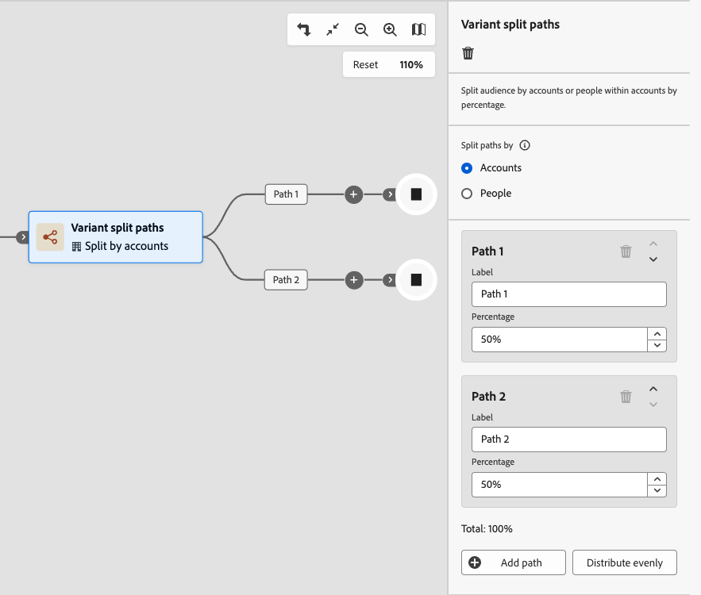

# Percorsi suddivisi per variante

Utilizza un nodo _Percorsi suddivisi variante_ per distribuire account o persone in due o più percorsi di percorso in base alle allocazioni percentuali definite. Questo nodo è utile quando desideri testare diverse tattiche di messaggistica, tempistica o coinvolgimento tra segmenti del pubblico senza applicare regole condizionali.

>[!AVAILABILITY]
>
>Il nodo _Percorsi suddivisi variante_ per percorsi di account e persone è disponibile per alcuni clienti come funzionalità di disponibilità limitata. Per ottenere l’accesso, contatta il tuo rappresentante Adobe.

## Confronto per tipo di percorso {#journey-type-comparison}

Il nodo percorsi suddivisi variante utilizza algoritmi di assegnazione diversi a seconda del tipo di percorso. Comprendere questa differenza è importante per scegliere il caso d’uso corretto per ogni tipo di percorso.

| | Percorsi account | Percorsi di persone |
| - | ---------------- | --------------- |
| **Algoritmo** | Assegnazione casuale basata su quota | Assegnazione hash deterministico |
| **Determinismo** | Non deterministico: lo stesso conto può essere assegnato a un percorso diverso al rientro, a seconda dello stato di quota corrente. | Deterministico: la stessa persona viene sempre assegnata allo stesso percorso per un determinato percorso pubblicato, indipendentemente dal numero di volte in cui entra o rientra. |
| **Test A/B** | Non adatto: l&#39;assegnazione del percorso non è stabile tra i rientri. | Idoneo: l&#39;assegnazione coerente dei percorsi per persona supporta gli esperimenti controllati e l&#39;attribuzione. |
| **Comportamento rientro** | L&#39;account può seguire un percorso diverso ogni volta che entra nel percorso. | La persona segue sempre lo stesso percorso che le era stato assegnato al primo ingresso. |
| **Precisione della distribuzione** | All’interno di un account per percorso a causa dell’applicazione della quota. | Converge entro il ±2% delle percentuali configurate a 1.000 o più voci di percorso. |

## Confronto con percorsi suddivisi {#compare-split-paths}

Entrambi i _[percorsi suddivisi](./split-merge-paths-nodes.md)_ e _percorsi suddivisi varianti_ dividono un percorso in più rami (percorsi), ma utilizzano meccanismi diversi:

| Formato | Suddividi percorsi | Percorsi suddivisi per variante |
| -------- | ----------- | ------------------- |
| **Logica di assegnazione** | _Basata su regole condizionali_: ogni entità viene valutata in base a condizioni definite e procede lungo il primo percorso corrispondente. | _Assegnazione basata su percentuale_: le entità vengono distribuite tra i percorsi in base alle percentuali configurate senza condizioni di filtro. |
| **Determinismo** | _Deterministico_ — La stessa entità segue sempre lo stesso percorso purché corrisponda alle stesse condizioni. | _Dipende dal tipo di percorso_ - I percorsi di persone sono deterministici (la stessa persona segue sempre lo stesso percorso per un percorso pubblicato). I percorsi di conti non sono deterministici (basati sulle quote). |
| **Altri account/percorso persone** | _Supportati_ — Le entità che non corrispondono a un percorso definito possono essere instradate a un percorso predefinito. | _Non applicabile_ — A ogni entità che raggiunge il nodo viene assegnato un percorso. |
| **Caso d’uso** | Segmento per attributi noti dell’account o della persona; valutazione ordinata in base alla priorità. | Distribuisci entità per testare messaggi, tempistiche o tattiche. Percorsi di persone: adatti per esperimenti A/B. Percorsi di account: adatti per la distribuzione casuale senza coerenza per account. |

## Percorsi account {#account-journeys}

Per i percorsi di account, l&#39;algoritmo di distribuzione utilizza [assegnazione casuale basata su quota](#account-journeys--quota-based-random-assignment). Questo algoritmo è **_non deterministico_**: lo stesso account potrebbe essere assegnato a un percorso diverso ogni volta che entra o entra di nuovo nel percorso. L&#39;assegnazione del percorso dipende dallo stato corrente della quota al momento della valutazione e non da una proprietà di conto fisso.

### Dividi per account {#split-by-account}

Quando un account raggiunge un nodo di percorsi suddivisi variante, il runtime valuta quanti account sono già stati assegnati a ciascun percorso durante l’istanza di percorso corrente e indirizza l’account al percorso più al di sotto della quota configurata.

* Ogni account viene assegnato esattamente a un percorso.
* L&#39;assegnazione è basata sulla quota. L’algoritmo regola dinamicamente le allocazioni per avvicinarsi alle percentuali configurate nell’intera popolazione.
* Poiché l&#39;algoritmo tiene traccia dei conteggi delle quote, la distribuzione effettiva deriva solo di un account al massimo per percorso a causa dell&#39;arrotondamento quando i totali non si dividono in modo uniforme.

### Dividi per persone {#split-by-people}

In un percorso di account, puoi anche utilizzare un nodo di percorsi suddivisi di varianti per distribuire _persone all&#39;interno di account_ in modo casuale tra percorsi basati su percentuali. Questo tipo di suddivisione è utile quando si desidera testare contenuti o esperienze diversi a livello di persona. Gli account continuano a spostarsi nel percorso. Il nodo percorsi suddivisi per persone della variante funziona con i seguenti guardrail:

* Il nodo funziona come _nodo raggruppato_, ovvero una combinazione di unione divisa. I percorsi suddivisi si chiudono automaticamente in corrispondenza di un nodo di unione corrispondente in modo che tutte le persone possano procedere senza perdere il contesto dell’account.
* Ogni persona nell’account viene assegnata a un solo percorso in base alle percentuali configurate.
* Lo stesso algoritmo basato sulla quota utilizzato per gli account si applica alle persone. L’assegnazione del percorso non è deterministica e la stessa persona può seguire un percorso diverso al rientro.
* Solo i nodi _[!UICONTROL Esegui un&#39;azione]_ per le persone sono supportati nei percorsi. I percorsi non possono essere ulteriormente suddivisi.

>[!BEGINSHADEBOX &quot;Comportamento di distribuzione tra persone&quot;]

Le persone all’interno di un account vengono elaborate come batch. Il numero assegnato a ogni percorso è calcolato come `floor(percentage / 100 × people_in_account)` e il **ultimo percorso configurato riceve tutte le persone rimanenti**. Ciò significa che:

* Quando un account ha un numero dispari di persone, l’ultimo percorso riceve una persona in più rispetto ai percorsi precedenti.
* Per gli account con una singola persona, questa viene sempre assegnata al primo percorso indipendentemente dalle percentuali configurate.
* Per gli account con poche persone (meno di 10), la distribuzione per account può differire notevolmente dalle percentuali configurate. La distribuzione converge verso i rapporti configurati quando misurata tra più account.

>[!NOTE]
>
>Questo comportamento di arrotondamento si applica per batch di conti e non per tutti gli account del percorso. L’ultimo percorso riceve sistematicamente un numero leggermente maggiore di persone rispetto a quanto configurato quando le dimensioni dell’account sono dispari. Questo è il comportamento previsto.

>[!ENDSHADEBOX]

## Percorsi di persone {#person-journeys}

Quando una persona raggiunge un nodo di percorsi suddivisi variante, il runtime li mappa su un percorso in base a un hash del proprio ID e dell’ID percorso.

* A ogni persona viene assegnato esattamente un percorso.
* L&#39;assegnazione è deterministica: la stessa persona riceve sempre la stessa assegnazione di percorso per un determinato percorso pubblicato, indipendentemente dal numero di inserimenti o reinserimenti.
* L’hash viene calcolato solo dall’ID persona e dall’ID percorso. Non dipende dalla posizione del nodo, dall&#39;ora di immissione o da qualsiasi stato di quota. Ciò significa che il reinserimento nel percorso produce ogni volta la stessa assegnazione del percorso.

>[!NOTE]
>
>**La suddivisione della variante del percorso di persone è adatta per test A/B ed esperimenti.**
>
>Poiché l’assegnazione è deterministica e coerente tra i rientri, i percorsi di suddivisione delle varianti nei percorsi di persone supportano esperimenti controllati in cui la stessa persona deve ricevere coerentemente la stessa esperienza. Utilizza la visualizzazione [Dettagli percorso](./journey-details.md) per monitorare la distribuzione tra i percorsi dopo che il percorso è attivo.

## Algoritmo di distribuzione

L’algoritmo di distribuzione applicato dipende dal tipo di percorso.

### Percorsi di conti — Assegnazione casuale basata su quota

Il nodo dei percorsi suddivisi delle varianti nei percorsi di account utilizza un algoritmo **quota-based random assignment**. Quando un account raggiunge il nodo, il runtime valuta quanti account sono già stati assegnati a ciascun percorso durante l’istanza di percorso corrente e indirizza l’account al percorso più al di sotto della quota configurata.

**Proprietà chiave dell&#39;algoritmo basato su quote:**

* La distribuzione tiene traccia da vicino delle percentuali configurate in tutti i volumi di account. Poiché l&#39;algoritmo gestisce attivamente i conteggi delle quote, la distribuzione effettiva viene spostata solo di un conto per percorso a causa dell&#39;arrotondamento quando i totali non si dividono in modo uniforme.

### Percorsi di persone — Assegnazione hash deterministica

Il nodo dei percorsi suddivisi delle varianti nei percorsi di persone utilizza un algoritmo di assegnazione hash **deterministico**. Quando una persona raggiunge il nodo, il runtime calcola un valore hash dall’ID persona e dall’ID percorso, quindi mappa il risultato su un percorso in base agli intervalli percentuali configurati. L’algoritmo viene applicato utilizzando il seguente flusso di lavoro:

1. Il runtime calcola un hash MurmurHash3 a 32 bit da una chiave composita che combina l’ID persona e l’ID percorso.
1. Il valore hash viene mappato su una posizione in un intervallo di 10.000 bucket di uguali dimensioni.
1. I bucket vengono partizionati in base alle percentuali di percorso configurate. Ad esempio, con percorsi al 30%, 30% e 40%, i primi 3.000 bucket corrispondono al percorso 1, i successivi 3.000 al percorso 2 e i rimanenti 4.000 al percorso 3.
1. La persona è assegnata al percorso il cui intervallo di bucket contiene la relativa posizione hash.

Esistono due proprietà chiave dell&#39;algoritmo hash deterministico:

* **_Coerenza_** — La stessa persona viene sempre assegnata allo stesso bucket per un determinato ID percorso. Se si accede di nuovo al percorso, ogni volta viene creata la stessa assegnazione di percorso.
* **_Distribuzione statistica_**: la distribuzione converge entro il ±2% delle percentuali configurate quando almeno 1.000 persone univoche sono entrate nel percorso. Con tipi di pubblico più piccoli, i conteggi per percorso possono differire in modo più evidente dai rapporti configurati.

## Limitazioni {#limitations}

Esamina queste limitazioni prima di utilizzare percorsi di suddivisione varianti nei percorsi.

### Limitazioni del percorso dell’account {#account-journey-limitations}

>[!IMPORTANT]
>
>**L&#39;assegnazione del percorso non è deterministica.**
>
>L&#39;algoritmo basato sulla quota non garantisce che lo stesso account segua sempre lo stesso percorso. Se un conto esce e entra nuovamente nel percorso, può essere assegnato a un percorso diverso a seconda dello stato della quota al momento della reintroduzione. Non utilizzare i percorsi di suddivisione delle varianti del percorso di account per i casi d’uso che richiedono un’assegnazione coerente del percorso per account tra le istanze del percorso.

| Limitazione | Descrizione |
| ---------- | ----------- |
| **Non adatto per esperimenti controllati** | Poiché l&#39;assegnazione dei percorsi non è deterministica, i percorsi di suddivisione delle varianti nei percorsi di account **non sono adatti** per esperimenti A/B o scenari di attribuzione che richiedono che un determinato account riceva costantemente lo stesso trattamento. |
| **Deriva di arrotondamento minore** | Quando il conteggio totale dei conti non è divisibile in modo uniforme in base alle percentuali configurate, la distribuzione può essere disattivata di almeno un conto per percorso. Si tratta di un comportamento di arrotondamento previsto e non di un errore. |
| **L&#39;assegnazione del percorso non è idempotente** | Una nuova immissione nel percorso può produrre un&#39;assegnazione di percorso diversa per lo stesso account. |
| **Nessun filtro condizionale** | A differenza di _Percorsi suddivisi_, i percorsi suddivisi varianti non applicano condizioni. Ogni account che raggiunge il nodo viene assegnato a un percorso. |

### Limitazioni del percorso di persone {#person-journey-limitations}

| Limitazione | Descrizione |
| ---------- | ----------- |
| **Varianza statistica su piccola scala** | La distribuzione converge alle percentuali configurate entro circa il ±2% quando almeno 1.000 persone univoche sono entrate nel percorso. Con un numero minore di voci, i conteggi per percorso possono differire in modo più evidente dai rapporti configurati. Questo è il comportamento previsto della distribuzione hash e non è un errore. |
| **Nessun filtro condizionale** | A differenza di _Percorsi suddivisi_, i percorsi suddivisi varianti non applicano condizioni. A ogni persona che raggiunge il nodo viene assegnato un percorso. |

## Aggiungi un nodo di percorsi suddivisi variante {#add-variant-split-paths-node}

I passaggi per aggiungere e configurare un nodo di percorso di divisione variante sono gli stessi sia per i percorsi account che per quelli persona.

1. Passa alla mappa del percorso.

1. Fai clic sull&#39;icona _Aggiungi_ ( **+** ) in un percorso e scegli **[!UICONTROL Percorsi suddivisi variante]**.

   {width="300" zoomable="no"}

   Nella mappa di percorso, il nodo ha due percorsi predefiniti.

1. (_Solo percorsi di account_) Nelle proprietà del nodo a destra, scegli **[!UICONTROL Account]** o **[!UICONTROL Persone]** per la suddivisione.

   Se si utilizza il tipo _[!UICONTROL Persone]_, viene inserito automaticamente un nodo _Chiudi percorsi di suddivisione varianti_ per chiudere la suddivisione raggruppata.

   {width="700" zoomable="yes"}

1. Rivedi o aggiorna l&#39;**[!UICONTROL etichetta]** per ogni percorso.

   Le etichette dei percorsi vengono visualizzate come etichette dei bordi nell’area di lavoro del percorso e aiutano a distinguere i percorsi nell’analisi del percorso.

   {width="600" zoomable="yes"}

1. Imposta **[!UICONTROL Percentuale]** per ogni percorso.

   I valori devono essere numeri interi compresi tra 1 e 99.

   {width="500" zoomable="yes"}

   L&#39;indicatore del totale parziale mostra la somma di tutte le percentuali di percorso. Il totale deve essere esattamente pari al 100% prima che sia possibile pubblicare il percorso. Se il totale non è uguale a 100%, viene visualizzato uno stato di errore.

   {width="500" zoomable="yes"}

   Per distribuire le percentuali in modo uniforme in tutti i percorsi, fare clic su **[!UICONTROL Distribuisci in modo uniforme]**. Il sistema calcola le quote uguali e regola gli arrotondamenti per garantire che il totale sia uguale al 100%.

1. Per definire percorsi aggiuntivi, fare clic su **[!UICONTROL Aggiungi percorso]** per ciascuno di essi.

   Il nodo supporta fino a 20 percorsi. Quando aggiungi altri percorsi, regola _[!UICONTROL Percentuale]_ in modo che il totale sia uguale al 100%.

   È possibile rimuovere un percorso facendo clic sull&#39;icona _Elimina_ (  ) nella scheda del percorso. Un percorso può essere rimosso solo quando rimangono almeno due percorsi.

   Le seguenti regole si applicano alla configurazione del percorso di divisione variante. Le violazioni bloccano la pubblicazione del percorso.

   | Regola | Requisito |
   | ---- | ----------- |
   | Percorsi minimi | 2 |
   | Numero massimo di percorsi | 20 |
   | Percentuale per percorso | Numero intero da 1 a 99 |
   | Percentuale totale | Deve essere uguale esattamente a 100% |
