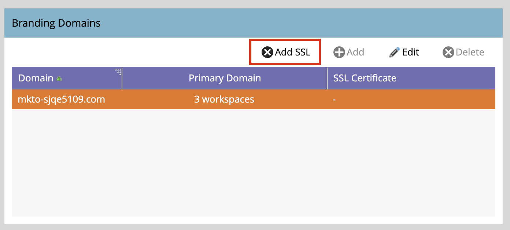

# Configurare i domini di branding

Un dominio di branding in Marketo Engage è un sottodominio personalizzato (ad esempio `links.yourcompany.com`) utilizzato per riscrivere i collegamenti e tenere traccia dei clic sulle e-mail e assicurarsi che riflettano il tuo marchio anziché un dominio generico. Ogni dominio di branding funge da dominio di tracciamento dei clic per migliorare il recapito messaggi e l’attendibilità facendo corrispondere i collegamenti e-mail e pagina di destinazione al dominio.

* Sostituisce i collegamenti generici con il tuo branding nei collegamenti ipertestuali delle e-mail.
* Quando un lead dell’account fa clic su un collegamento, reindirizza attraverso questo dominio personalizzato per consentire il tracciamento delle prestazioni pur apparendo legittimo ai filtri e-mail.
* Se disponi di più marchi, puoi configurare altri domini di branding per supportare diverse business unit o marchi.

>[!BEGINSHADEBOX]

**CNAME univoci per il tracciamento dei collegamenti**

I collegamenti di tracciamento e-mail devono essere nuovi e univoci per l’istanza Marketo Engage allegata. Se disponi di CNAME esistenti per il tracciamento dei collegamenti che puntano a un’istanza Marketo Engage (di produzione) preesistente, non puoi riutilizzarli senza modifiche.

Puoi condividere il branding del dominio del percorso di ritorno tra l’istanza Marketo Engage di produzione e l’istanza associata, ma si tratta di una modifica di back-end. Apri un ticket di supporto e fornisci il prefisso Marketo Engage (Munchkin ID) e il nuovo prefisso Journey Optimizer B2B edition (Munchkin ID) per richiedere il branding del dominio del percorso di ritorno condiviso.

>[!ENDSHADEBOX]

>[!PREREQUISITES]
>
>Prima di modificare o aggiungere un dominio nell&#39;interfaccia utente, è necessario disporre di un [CNAME mappato a un dominio Marketo Engage fornito da Adobe](https://experienceleague.adobe.com/it/docs/marketo/using/getting-started/initial-setup/setup-steps#customize-your-landing-page-urls-with-a-cname){target="_blank"}.
>
>Quando si aggiunge un dominio, il sistema verifica la presenza di SSL preesistenti, che potrebbero essere stati creati manualmente in precedenza. Se si verifica questa convalida, crea il dominio senza selezionare la creazione SSL, quindi collegalo come procedura separata.

## Accedere ai domini di branding in Marketo Engage

1. Vai all&#39;area **[!UICONTROL Amministratore]** nella tua istanza di Marketo Engage e seleziona **[!UICONTROL E-mail]**.

1. Scorri verso il basso fino al pannello **[!UICONTROL Domini di branding]**.

   {width="700" zoomable="yes"}

   Nell&#39;elenco viene visualizzato il dominio predefinito per l&#39;istanza Marketo Engage.

## Modifica il dominio di branding predefinito

Il primo passaggio nell’utilizzo dei domini di branding consiste nella modifica del dominio di branding predefinito definito nell’istanza Marketo Engage.

>[!NOTE]
>
>Non puoi definire un dominio di branding aggiuntivo finché non hai modificato il dominio predefinito generico.

1. Nel pannello _[!UICONTROL Domini di branding]_, seleziona il dominio generico e fai clic su **[!UICONTROL Modifica]** nella parte superiore.

   {width="500"}

1. Nella finestra di dialogo _[!UICONTROL Modifica dominio di branding]_, immetti il nome del dominio predefinito nel campo **[!UICONTROL Dominio]**.

   {width="400"}

1. Se per l&#39;istanza di Marketo Engage sono state definite più aree di lavoro, fare clic su **[!UICONTROL Avanti]**.

   Seleziona ciascuna delle aree di lavoro in cui desideri applicare il dominio primario aggiornato.

   {width="400"}

1. Fai clic su **[!UICONTROL Salva]**.

## Definisci un dominio aggiuntivo

Dopo aver modificato il dominio predefinito, puoi aggiungere un altro dominio di branding per supportare più marchi nell’ambiente Journey Optimizer B2B Edition, ciascuno dei quali dispone di collegamenti di tracciamento con marchio. Quando si aggiunge un dominio, sono disponibili le seguenti opzioni:

>* _Rendi dominio primario_: rendi questo dominio primario per l&#39;area di lavoro. Quando selezioni questa opzione, tutte le e-mail non inviate esistenti vengono impostate sul dominio primario predefinito e tutte le e-mail appena create vengono impostate automaticamente su questo dominio primario. Se necessario, gli addetti al marketing possono scegliere un dominio di branding alternativo.
>
>* _Genera certificato SSL_: crea un SSL (Secure Sockets Layer) con la creazione del dominio. Il primo dominio di tracciamento avvia una configurazione unica dell’infrastruttura che potrebbe richiedere alcune ore. Il sistema invia una notifica al completamento.

_Per aggiungere il dominio :_

1. Nel pannello _[!UICONTROL Domini di branding]_, fai clic su **[!UICONTROL Aggiungi]** nella parte superiore.

   {width="500"}

1. Nella finestra di dialogo _[!UICONTROL Nuovo dominio di branding]_ immettere il nome del dominio di branding nel campo **[!UICONTROL Dominio]**.

1. (Facoltativo) Selezionare la casella di controllo **[!UICONTROL Genera certificato SSL]** per generare automaticamente un SSL per il dominio.

   {width="400"}

   Se necessario e disponibile, è inoltre possibile selezionare la casella di controllo _Rendi dominio primario_.

   >[!NOTE]
   >
   >**_SSL personalizzati_**: se hai bisogno di un SSL personalizzato, puoi inviare un [ticket di supporto](https://experienceleague.adobe.com/it/support){target="_blank"}. Non utilizzare la casella di controllo per la creazione SSL.

1. Se per l&#39;istanza di Marketo Engage sono state definite più aree di lavoro, fare clic su **[!UICONTROL Avanti]**.

   Se necessario, selezionate ciascuna delle aree di lavoro in cui desiderate applicare il nuovo dominio come dominio principale.

   {width="400"}

1. Fai clic su **[!UICONTROL Salva]**.

## Modificare gli SSL per i domini di branding esistenti

Per abilitare SSL per i domini esistenti, segui la procedura riportata di seguito.

1. Dall&#39;area _[!UICONTROL Amministrazione]_, selezionare **[!UICONTROL Posta elettronica]**.

1. Nel pannello _[!UICONTROL Domini di branding]_, seleziona la riga del dominio e fai clic su **[!UICONTROL Aggiungi SSL]**.

   {width="500"}

1. Nella finestra di dialogo, fai clic su **[!UICONTROL Conferma]**.

   {width="400"}

## Messaggi di errore

| Errore | Dettagli |
| ----- | ------- |
| `Domain already exists.` | Esiste già un dominio con lo stesso nome. |
| `Domain is not mapped to the default domain.` | Il dominio personalizzato non è mappato correttamente al dominio predefinito. Verificare le impostazioni di mappatura del dominio e assicurarsi che la configurazione DNS punti al dominio predefinito corretto. |
| `SSL certificates could not be issued due to unsupported CAA records. Request your IT to update your CAA records.` | Record CAA non aggiornati. Per coloro che utilizzano certificati SSL gestiti da Adobe, i record CAA devono essere aggiornati ai certificati consigliati dal fornitore. |
| `SSL certificate has already been issued.` | Esiste già un certificato SSL per questo dominio personalizzato. Non sono necessarie ulteriori azioni, a meno che il certificato non sia scaduto o debba essere nuovamente emesso. |
| `The default domain was not found. Please contact Support for assistance.` | Si è verificato un problema durante il tentativo di individuare il dominio predefinito. Contatta il supporto Adobe per attivare le indagini. |
| `Unexpected error encountered while creating a domain. Please contact Support for assistance.` | Errore imprevisto. Raccogli i registri e i dettagli dell’errore, quindi inoltra il problema al supporto Adobe. |

## Eliminare un dominio di branding

>[!NOTE]
>
>Se si desidera eliminare il dominio di branding principale (in una o più aree di lavoro), è innanzitutto necessario selezionare un dominio di branding diverso come dominio principale per ogni area di lavoro.
>
>L&#39;eliminazione di un dominio **_non_** elimina il certificato SSL. Questo guardrail evita errori degli utenti che determinano la mancanza di certificati SSL in un sito Web. Se desideri rimuovere i certificati SSL, contatta il supporto Adobe.

Nel pannello _[!UICONTROL Domini di branding]_, seleziona il dominio e fai clic su **[!UICONTROL Elimina]** nella parte superiore.
