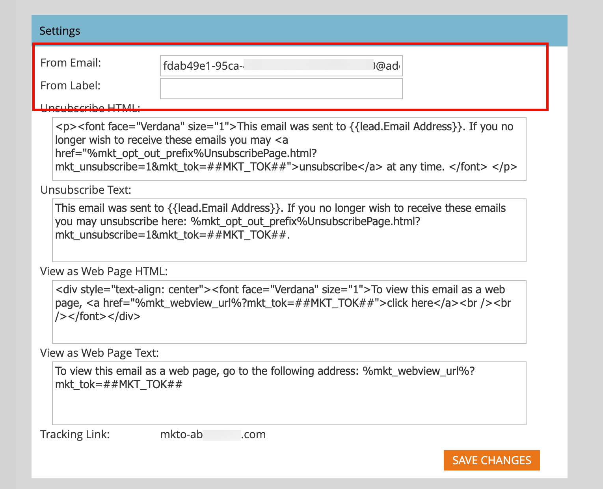
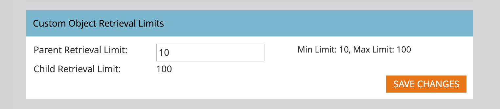
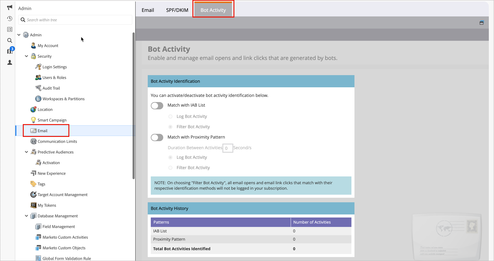

# Configurazione e-mail

Per supportare l’infrastruttura di consegna e-mail fornita dall’istanza Marketo Egage allegata, imposta le seguenti opzioni e-mail. Un amministratore di prodotto Marketo Engage può configurare queste impostazioni passando all&#39;area **[!UICONTROL Amministratore]** nell&#39;istanza di Marketo Engage e selezionando **[!UICONTROL E-mail]**.

## Impostazioni e-mail

Per impostare i valori predefiniti delle e-mail per l’istanza Marketo Engage associata, modifica i valori configurati in modo che riflettano l’utilizzo da parte dell’organizzazione di marketing.

### Da e-mail ed etichetta

Modifica i valori per e-mail ed etichetta Da in modo che le nuove e-mail vengano automaticamente compilate con questi valori predefiniti.

>[!NOTE]
>
>La modifica è applicabile solo alle e-mail che hai creato e non ad altri utenti di Marketo Engage o Journey Optimizer B2B edition.

1. Vai all&#39;area **[!UICONTROL Amministratore]** nell&#39;istanza Marketo Engage allegata e seleziona **[!UICONTROL E-mail]**.

1. Nel pannello _[!UICONTROL Impostazioni]_, immetti i valori predefiniti per **[!UICONTROL Da e-mail]** e **[!UICONTROL Da etichetta]**.

   {width="500"}

1. Fai clic su **[!UICONTROL Salva modifiche]**.

### Messaggi per annullare l’abbonamento

Per le e-mail di marketing non operative, il testo e i collegamenti per l’annullamento dell’abbonamento vengono aggiunti in basso. In qualità di amministratore di prodotto, devi configurare il HTML predefinito e il testo che viene popolato quando un addetto marketing non contrassegna l’e-mail come operativa.

1. Vai all&#39;area **[!UICONTROL Amministratore]** nell&#39;istanza Marketo Engage allegata e seleziona **[!UICONTROL E-mail]**.

1. Nel pannello _[!UICONTROL Impostazioni]_, immetti i valori predefiniti desiderati per **[!UICONTROL Annulla abbonamento a HTML]** e **[!UICONTROL Annulla abbonamento testo]**.

   >[!TIP]
   >
   >Gli addetti al marketing possono modificare la posizione di HTML che annulla l’abbonamento nella propria e-mail utilizzando i token di sistema.

   {width="500"}

   >[!CAUTION]
   >
   >Le seguenti variabili sono critiche. **Non eliminarli**.
   >
   >* `%mkt_opt_out_prefix%`
   >* `mkt_unsubscribe=1&mkt_tok=##MKT_TOK##`

1. Fai clic su **[!UICONTROL Salva modifiche]**.

Se hai bisogno di ripristinare il contenuto di sistema predefinito, copia e incolla quanto segue:

+++ Testo predefinito per l’annullamento dell’iscrizione

```
<p><font face="Verdana" size="1">If you no longer wish to receive these emails, click on the following link: <a href="%mkt_opt_out_prefix%UnsubscribePage.html?mkt_unsubscribe=1&mkt_tok=##MKT_TOK##">Unsubscribe</a><br/></font></p>` [!UICONTROL Unsubscribe Text]:
%mkt_opt_out_prefix%UnsubscribePage.html?mkt_unsubscribe=1&mkt_tok=##MKT_TOK##
```

+++

### Visualizza come pagina Web

Il contenuto delle e-mail ha funzionalità di visualizzazione limitate (CSS limitate e nessun JavaScript o moduli). Gli addetti al marketing possono utilizzare l&#39;opzione _Visualizza come pagina Web_ per applicare un cookie al destinatario dell&#39;e-mail che utilizza Marketo Munchkin. In qualità di amministratore di prodotto, devi configurare il HTML predefinito e il testo che viene popolato quando un addetto marketing sceglie questa opzione.

1. Vai all&#39;area **[!UICONTROL Amministratore]** nell&#39;istanza Marketo Engage allegata e seleziona **[!UICONTROL E-mail]**.

1. Nel pannello _[!UICONTROL Impostazioni]_, modifica il contenuto nei campi **[!UICONTROL Visualizza come pagina Web HTML]** e **[!UICONTROL Visualizza come testo pagina Web]** per riflettere il tono e la messaggistica.

   {width="500"}

   >[!CAUTION]
   >
   >Le seguenti variabili sono critiche. **Non eliminarli**.
   >
   >`%mkt_webview_url%?mkt_tok=##MKT_TOK##`
   >
   >La seconda parte `##MKT_TOK##` è il cookie Munchkin di quella persona. In questo modo, i cookie vengono applicati correttamente quando il destinatario dell’e-mail fa clic sul collegamento.
   >
   >Assicurati di evitare:
   >
   >* Aggiunta di URL aggiuntivi a una delle caselle di HTML
   >* Inserimento di HTML nella versione di testo

1. Fai clic su **[!UICONTROL Salva modifiche]**.

Se hai bisogno di ripristinare il contenuto di sistema predefinito, copia e incolla quanto segue:

+++ Pagina Web predefinita del sistema HTML

```
<div style="text-align: center"><font face="Verdana" size="1">To view this email as a web page, <a href="%mkt_webview_url%?mkt_tok=##MKT_TOK##">click here</a></font></div>
```

+++

+++ Testo predefinito della pagina Web del sistema

```
To view this email as a web page, go to the following address:
`%mkt_webview_url%?mkt_tok=##MKT_TOK##`
```

+++

## Limiti di recupero degli oggetti personalizzati

Se utilizzi [!DNL Velocity Script] per visualizzare i dati oggetto personalizzati nelle e-mail, regola il limite di recupero dell&#39;oggetto personalizzato padre. Per impostazione predefinita, il limite consente l’accesso a 10 oggetti personalizzati principali dallo script Velocity. Se necessario, puoi aumentare questo limite.

[[!DNL Apache Velocity]](https://velocity.apache.org/) è un linguaggio basato su [!DNL Java] progettato per la creazione di modelli e lo scripting del contenuto di HTML. L’infrastruttura e-mail di Marketo Engage supporta il suo utilizzo nel contesto delle e-mail tramite token di script, che forniscono accesso ai dati memorizzati negli oggetti personalizzati.

È possibile fare riferimento a oggetti personalizzati padre e figlio direttamente connessi al lead o al contatto, ma non a oggetti personalizzati di terzo livello. Per ogni oggetto personalizzato, i 10 record aggiornati più di recente per persona/contatto sono disponibili in fase di esecuzione e vengono ordinati dall&#39;ultimo aggiornamento (alle `0`) a quello più recente (alle `9`).

_Per modificare il limite :_

1. Vai all&#39;area **[!UICONTROL Amministratore]** nell&#39;istanza Marketo Engage allegata e seleziona **[!UICONTROL E-mail]**.

1. Scorri fino al pannello _[!UICONTROL Limiti di recupero oggetti personalizzati]_ e immetti un nuovo valore in **[!UICONTROL Limite di recupero padre]**
campo.

   {width="500"}

   Sono supportati valori da 10 a 100. Il _[!UICONTROL limite di recupero figlio]_ viene impostato automaticamente dividendo 1000 per il limite padre. Ad esempio, se imposti il limite padre su 50, il limite figlio viene calcolato come 20 (1000 ÷ 50 = 20).

1. Fai clic su **[!UICONTROL Salva modifiche]**.

## Opzioni intestazione personalizzate

Modifica le _[!UICONTROL opzioni di intestazione personalizzate]_ per l&#39;e-mail per configurare le intestazioni di collegamento di tracciamento e-mail. Abilita queste opzioni per implementare collegamenti di tracciamento sicuri utilizzando HTTPS con Strict Transport.

1. Vai all&#39;area **[!UICONTROL Amministratore]** nell&#39;istanza Marketo Engage allegata e seleziona **[!UICONTROL E-mail]**.

1. Scorri fino al pannello _[!UICONTROL Opzioni intestazione personalizzate]_ e modifica l&#39;impostazione in base ai criteri di tracciamento dei collegamenti:

   {width="500"}

   * **[!UICONTROL Trasporto sicuro]** - Imposta questa opzione su Abilitato per garantire che i collegamenti di tracciamento vengano sempre serviti tramite HTTPS (deve essere impostato solo per gli abbonamenti con collegamenti di tracciamento protetti da SSL).
   * **[!UICONTROL Max-age]** - Questo campo supporta la direttiva obbligatoria per specificare il tempo, in secondi, in cui il browser deve ricordarsi di accedere solo al dominio tramite HTTPS.
   * **[!UICONTROL IncludeSubDomains]** - Utilizzare questa opzione per includere la direttiva che applica il criterio HSTS a tutti i sottodomini dell&#39;host.

   >[!IMPORTANT]
   >
   >Rivedi queste impostazioni con il tuo team IT per assicurarti che siano allineate con i criteri della tua organizzazione. Impostazioni non corrette possono impedire ad alcuni visitatori di accedere ai tuoi collegamenti e-mail.

1. Fai clic su **[!UICONTROL Salva modifiche]**.

## Filtrare l’attività di bot e-mail {#filter-email-bots}

L&#39;attività di bot per e-mail, definita anche come interazione non umana (NHI), può gonfiare i dati relativi alle _aperture_ e _clic_ dell&#39;e-mail, distorcendo le metriche di coinvolgimento e attivando la progressione del percorso basato su eventi. Utilizza il filtro dei bot e-mail per mantenere l’integrità delle metriche e delle informazioni sul coinvolgimento nei clic. Esistono due metodi per identificare una sospetta attività da bot:

* _&#x200B;**[!UICONTROL Corrispondenza con l&#39;elenco di bot IAB]**&#x200B;_ - Le attività che corrispondono a qualsiasi elemento nell&#39;[Elenco di bot di Interactive Advertising Bureau](https://www.iab.com/guidelines/iab-abc-international-spiders-bots-list/){target="_blank"} (Agente utente/Indirizzo IP) sono contrassegnate come bot.
* _&#x200B;**[!UICONTROL Corrispondenza con pattern di prossimità]**&#x200B;_ - Due o più attività che si verificano contemporaneamente (in meno di un secondo) sono identificate come bot. Attributi considerati durante il confronto:
   * ID lead (deve essere lo stesso)
   * Risorsa e-mail (deve essere la stessa)
   * Clic collegamento o apertura e-mail

Per l’attività di clic e apertura di e-mail con collegamento, gli attributi vengono compilati con i seguenti valori:

* Attività identificate come bot - _Attività bot_ = `true` e _Pattern attività bot_ = pattern/metodo identificato
* Attività identificate come non bot - _Attività bot_ = `false` e _Pattern attività bot_ = `n/a`

### Impostare i filtri

1. Vai all&#39;area **[!UICONTROL Amministratore]** nell&#39;istanza Marketo Engage allegata e seleziona **[!UICONTROL E-mail]**.

1. Selezionare la scheda **[!UICONTROL Attività bot]**.

   {width="700" zoomable="yes"}

   Nel pannello Identificazione attività bot vengono visualizzati due cursori che è possibile utilizzare per identificare l’attività bot.

1. Attiva/disattiva il dispositivo di scorrimento per attivarne uno o entrambi.

   Per ogni metodo abilitato, scegliere _[!UICONTROL Attività bot di registro]_ o _[!UICONTROL Attività bot di filtro]_.

   >[!IMPORTANT]
   >
   >Se scegli [!UICONTROL Filtra attività bot], potrebbe verificarsi un calo dei clic e delle aperture delle e-mail a causa dell&#39;eliminazione delle attività false.

   {width="500"}

   Per _[!UICONTROL Match with Proximity Pattern]_, puoi anche impostare la quantità di secondi per **[!UICONTROL Duration Between Activities]** (il valore predefinito è `0`, il valore massimo è `3`).

   >[!NOTE]
   >
   >Con _Durata tra attività_ impostata su `0` secondi, Marketo Engage identifica le attività e-mail che si verificano nello stesso secondo. Se si verificano più attività e-mail entro la quantità di secondi specificata, viene identificata come attività bot.

   Per disattivare entrambi i metodi di filtro, spostare il dispositivo di scorrimento verso sinistra. In tal caso, i dati non vengono ripristinati.

### INSERIRE NELL&#39;ELENCO BLOCCATI IP

Adobe ha identificato un elenco di indirizzi IP responsabili della generazione di milioni di falsi impegni, in quanto tali impegni ricevuti da uno qualsiasi dei seguenti IP vengono automaticamente filtrati e non aggiunti all’istanza di Marketo Engage. Questo filtro può comportare una riduzione delle aperture delle e-mail, dei clic e di altre attività correlate. L&#39;elenco può essere aggiornato periodicamente.

+++ Indirizzi IP bloccati

* 40.94.34.52
* 40.94.34.86
* 52.34.76.65
* 54.70.53.60
* 54.71.187.124
* 60.28.2.248
* 64.235.150.252
* 64.235.153.10
* 64.235.153.2
* 64.235.154.105
* 64.235.154.109
* 64.235.154.140
* 64.74.215.1
* 64.74.215.100
* 64.74.215.138
* 64.74.215.139
* 64.74.215.142
* 64.74.215.146
* 64.74.215.150
* 64.74.215.154
* 64.74.215.158
* 64.74.215.162
* 64.74.215.164
* 64.74.215.166
* 64.74.215.170
* 64.74.215.174
* 64.74.215.176
* 64.74.215.178
* 64.74.215.51
* 64.74.215.56
* 64.74.215.58
* 64.74.215.59
* 64.74.215.86
* 64.74.215.98
* 65.154.226.101
* 66.249.91.149
* 70.42.131.106
* 74.125.217.116
* 74.217.90.250
* 104.129.41.4
* 104.47.55.126
* 104.47.58.126
* 104.47.70.126
* 104.47.73.126
* 104.47.73.254
* 104.47.74.126
* 128.220.160.1
* 155.70.39.101
* 162.129.251.14
* 162.129.251.42
* 208.52.157.204

>[!NOTE]
>
>Ogni indirizzo IP viene analizzato e analizzato meticolosamente prima di essere incluso in questo elenco, garantendo che vengano bloccati solo gli IP più critici e dannosi.

+++

